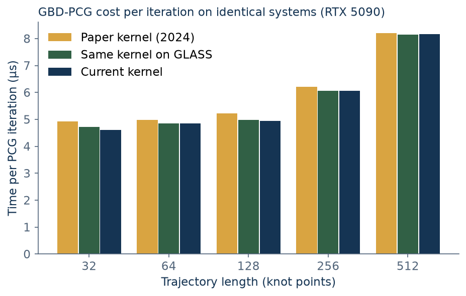
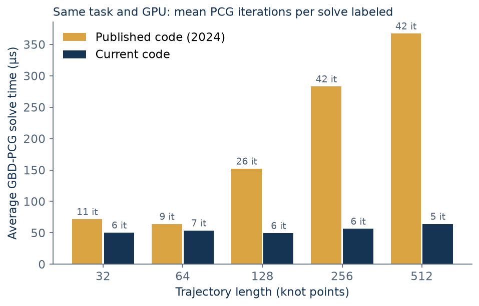

# Why the ICRA results moved (attribution, October 1, 2026)

For review before the main merge. The September 30 timing on the RTX 5090 gave GBD-PCG
average linear-system times of 50–64 µs at every horizon, against 75–360 µs in the paper.
QDLDL on the CPU stayed within about 15% of the paper, so the speedup over QDLDL grew from
1.0–3.6× to 1.8–17×. This document splits that change into its causes.

Average PCG solve time is iterations per solve times time per iteration, plus a fixed launch
and copy-back cost. Each factor was measured separately.

## 1. Iterations: the controller's linear systems got easier

Every kernel version takes exactly the same number of iterations on the same system. On one
captured N = 128 system from each pipeline, at the paper's absolute tolerance 10⁻⁴:

| Captured system | Paper kernel | Same kernel on GLASS | Current kernel |
| --- | ---: | ---: | ---: |
| Paper-era pipeline | 205 | 205 | 205 |
| Current pipeline | 18 | 18 | 18 |

So the iteration drop comes from the systems the controller produces, not from GBD-PCG or GLASS.
The paper-era system is symmetric and definite, so it was well formed. It has a 340× larger
right-hand side (182 versus 0.54) and a 2.9× larger preconditioned condition number
(2.9·10⁵ versus 1.0·10⁵). With an absolute exit test, a larger right-hand side needs many more
iterations to reach the same tolerance.

Which changes produced the easier systems: the paper-era code was rebuilt with each fix toggled
and run over the full circuit at N = 128, ε = 10⁻⁴ (correctness builds, 20 SQP iterations per step):

| Paper-era code variant | Mean PCG iterations | Solves hitting the cap | Mean L1 EE error |
| --- | ---: | ---: | ---: |
| As published | 18.8 | 5.8% | 6.0 cm |
| Horizon-tail index fixed | 11.5 | 3.3% | 2.0 cm |
| Gauss-Newton position Hessian | 5.2 | 0.7% | 3.9 cm |
| Both | 3.9 | 0.5% | 2.1 cm |
| Current code (corrected model and frame, terminal fix) | 6.0 | 0.5% | 1.7 cm |

- **Gauss-Newton Hessian (largest effect).** The 2024 cost used the outer product of the cost
  gradient as the position Hessian, a rank-1 matrix that vanishes as tracking error shrinks.
  JᵀJ keeps the EE curvature, which conditions the Schur system and cuts iterations 3.6×.
- **Horizon-tail index.** On every shift, the 2024 code refilled the horizon's last stage from
  the reference row at the current time instead of the row the last stage represents. That
  injected a large dynamics defect at the horizon's end, inflating the right-hand side.
- The corrected dynamics model and EE frame add back about two iterations per solve.

## 2. Time per iteration: kernel and GLASS

Identical captured systems, solved for a fixed 25 and 100 iterations with exit tolerance 0, three
alternating repeats of 300 timed solves each (October 1, 2026, exclusive window). The per-iteration
cost is the slope between the two; the one-iteration solve is the fixed launch and copy-back cost.

| N | Paper kernel (µs/iter) | On GLASS (µs/iter) | Current (µs/iter) | GLASS change | One-iteration solve, paper / current (µs) |
| ---: | ---: | ---: | ---: | ---: | ---: |
| 32 | 4.91 | 4.72 | 4.62 | -3.9% | 23.0 / 22.5 |
| 64 | 4.97 | 4.86 | 4.86 | -2.3% | 22.8 / 22.9 |
| 128 | 5.22 | 4.97 | 4.94 | -4.6% | 22.7 / 22.6 |
| 256 | 6.21 | 6.06 | 6.06 | -2.4% | 24.6 / 24.6 |
| 512 | 8.20 | 8.14 | 8.16 | -0.7% | 34.1 / 34.6 |

Moving GBD-PCG onto GLASS (commit `bc60729`, its only change) cut the time per iteration by 0.7–4.6%,
most at short and medium horizons. Later GBD-PCG changes, the relative tolerance, converged-start
guard and safety checks, left it unchanged. The fixed cost of about 23 µs at N ≤ 256 is the same in
every version, and it is most of today's 50–64 µs average because current solves need few iterations.



## 3. Hardware and toolchain

The published code was rebuilt unchanged for this GPU and run exactly as in the paper: 500 Hz,
2000 µs wall-clock SQP budget, linear-system timers, its middle tolerances, three repeats. Its
speedups over QDLDL are 1.2–2.9×, the same range as the published 1.0–3.6× and far from the current
code's 1.8–17×, so the new hardware does not explain the new results. Point by point it is close to the
published GBD-PCG times at N = 32, 128 and 512, faster at 64 and slower at 256. Its PCG time varies
strongly between runs: at N = 128 the three repeats gave 333, 152 and 138 µs, against about 150 µs read
from the published Figure 4. QDLDL on the CPU matches the published bars within about 15%.

| N | Paper code PCG (µs, median [range]) | Paper code iterations | Current PCG (µs) | Current iterations | Paper code QDLDL (µs) | Current QDLDL (µs) | Paper code speedup | Current speedup | Published speedup |
| ---: | ---: | ---: | ---: | ---: | ---: | ---: | ---: | ---: | ---: |
| 32 | 71 [71–72] | 10.9 | 50 | 6.4 | 86 | 88 | 1.2× | 1.8× | 1.0× |
| 64 | 64 [62–65] | 9.2 | 54 | 7.0 | 144 | 162 | 2.2× | 3.0× | 1.5× |
| 128 | 152 [138–333] | 25.8 | 49 | 5.6 | 276 | 275 | 1.8× | 5.6× | 1.9× |
| 256 | 283 [253–305] | 42.3 | 57 | 6.2 | 543 | 552 | 1.9× | 9.7× | 3.6× |
| 512 | 367 [362–391] | 41.8 | 64 | 5.2 | 1078 | 1099 | 2.9× | 17.2× | 3.3× |

Current-code columns are means over the three repeats, the statistic the plots and the replication
notes use; paper-code columns are medians with the range because of the N = 128 outlier.



## Summary

- **Iterations explain the change.** On the same machine and task, the current code needs 5–7 PCG
  iterations per solve at every horizon, the published code 9–42, growing with horizon. That makes
  today's GBD-PCG time nearly flat in N, while QDLDL still grows linearly, so the ratio grows with N.
- **The iteration drop comes from the controller, not the solver.** All kernel versions converge in the
  same number of iterations on a given system. The Gauss-Newton position Hessian conditions the Schur
  systems; the corrected horizon-tail index removes an injected defect that inflated their right-hand
  side. Both also improve tracking.
- **GLASS made each iteration 0.7–4.6% cheaper.** That is a real but small part of the change.
- **The hardware change is not the cause.** The published code on the RTX 5090 gives speedups in the
  published range, 1.2–2.9×.

These are internal linear-system times on one host. The paper's reported speedups remain correct for
the published code; the current speedups describe the current code.

## Reproduce

```bash
bash tools/attribution/prepare.sh                     # builds and captures; measures nothing
MPCGPU_QUIET_WINDOW=1 bash tools/attribution/run.sh   # exclusive quiet window only
```

The variant walk in section 1 applies `tools/attribution/paper-variants.patch` to the paper-era code
extracted by `prepare.sh` (`tmp/attribution/paper-code`), building with `-DFIX_TAIL_INDEX`,
`-DGN_HESSIAN`, `-DONLY_TOL_INDEX=2` and `-DDUMP_AT=<solve>` as needed. The patch is a measurement aid
for the historical code only; it is not part of the maintained solver.
